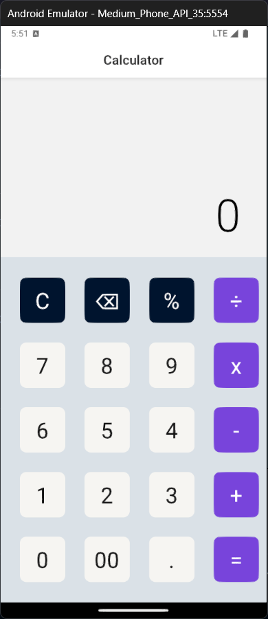
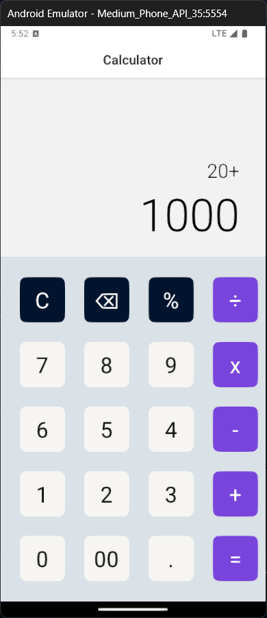

# Simple-Calculator

A clean and minimal calculator built with React Native. This app performs basic arithmetic operations addition, subtraction, multiplication, and division with a responsive UI that works across both Android and iOS devices.

## Features

- Basic arithmetic operations: addition, subtraction, multiplication, and division.
- User-friendly interface.
- Cross-platform support (iOS and Android).

## Installation

1. Clone the repository:
   ```bash
   git clone https://github.com/Chamindu-Gayanuka/Simple-Calculator.git
   ```
2. Navigate to the project directory:
   ```bash
   cd Simple-Calculator
   ```
3. Install dependencies:
   ```bash
   npm install
   ```

## Usage

1. Start the development server:
   ```bash
   npx expo start
   ```

## Screenshots

<div align = 'center'>
   
   
</div>

## Contributing

Contributions are welcome! Please open an issue or submit a pull request.

## License

This project is licensed under the [MIT License](LICENSE).
